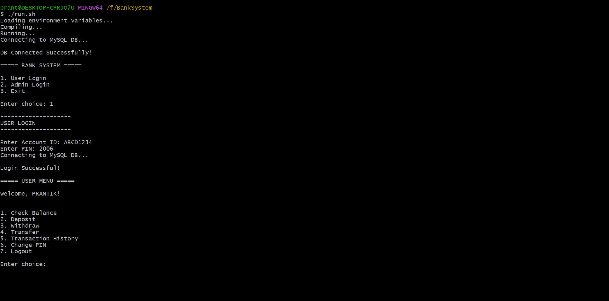
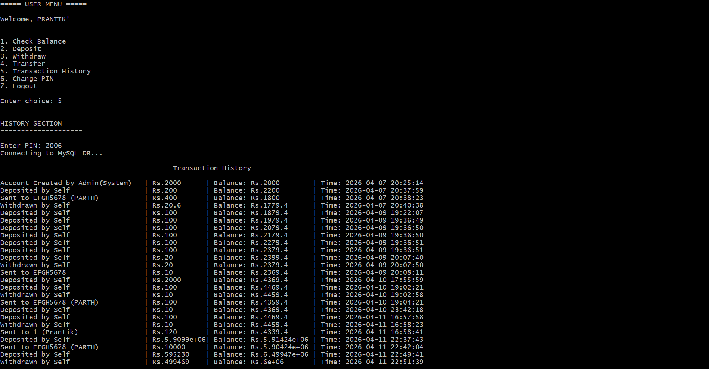
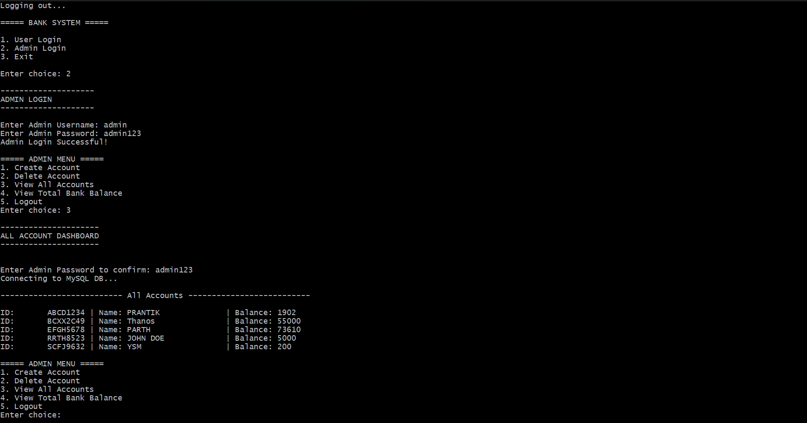

Bank Management System (C++ CLI)

Overview

This project is a command-line based Bank Management System implemented in C++ with MySQL integration. It simulates core banking operations such as account management, authentication, and financial transactions.

The system follows a modular architecture and demonstrates practical usage of database connectivity and structured programming.

---

Objectives

- Implement a real-world banking workflow in CLI
- Integrate C++ with MySQL database
- Use environment variables for secure configuration
- Practice modular and scalable design

---

Features

User Functionalities

- Login using Account ID and PIN
- View account balance
- Deposit money
- Withdraw money with validation
- Transfer funds
- View transaction history

Admin Functionalities

- Admin login
- View all accounts
- Monitor transactions
- Manage users

---

System Architecture

UI Layer (Menus)
↓
Business Logic (Core)
↓
Data Layer (DataManager)
↓
Database (MySQL)

Modules

- "ui/" – User interface
- "core/" – Business logic
- "data/" – Database operations
- "database/" – DB connection
- "models/" – Data structures
- "auth/" – Authentication
- "utils/" – Helpers

---

Technologies Used

- C++
- MySQL
- MySQL C API
- CLI

---

Database Design

accounts

CREATE TABLE accounts (
account_id VARCHAR(20) PRIMARY KEY,
name VARCHAR(100),
balance DOUBLE,
pin INT
);

transactions

CREATE TABLE transactions (
id INT AUTO_INCREMENT PRIMARY KEY,
account_id VARCHAR(20),
type VARCHAR(50),
amount DOUBLE,
balance DOUBLE,
timestamp DATETIME DEFAULT CURRENT_TIMESTAMP
);

---

Sample Data

INSERT INTO accounts VALUES
('ABCD1234','PRANTIK',2002,2006),
('EFGH5678','PARTH',73510,1234);

---

Prerequisites

- g++ (MinGW or equivalent)
- MySQL Server
- MySQL Workbench (optional)

---

Installation and Setup

Clone Repository

git clone https://github.com/Prantik400/Bank-Management-System-CPP.git

cd Bank-Management-System-CPP

---

Setup Database

CREATE DATABASE bank_system;
USE bank_system;

Create tables using schema above and insert sample data.

---

Configure Environment

Create ".env" file:

DB_HOST=localhost
DB_USER=root
DB_PASS=your_password
DB_NAME=bank_system
DB_PORT=3306

---

Run Project

chmod +x run.sh
./run.sh

---

Execution Flow

1. Connects to database
2. Displays menu
3. User selects operation
4. Executes logic
5. Updates database

---

Screenshots

Main Menu

Transaction History

Admin View

---

Security

- Uses environment variables
- ".env" excluded via ".gitignore"
- No credentials in code

---

Limitations

- CLI interface
- No encryption for PIN
- Basic admin system

---

Future Enhancements

- GUI / Web version
- Password hashing
- API integration
- Docker support

---

Learning Outcomes

- C++ + MySQL integration
- Modular design
- Real-world transaction handling

---

Author

Prantik

---

License

This project is for educational purposes.
